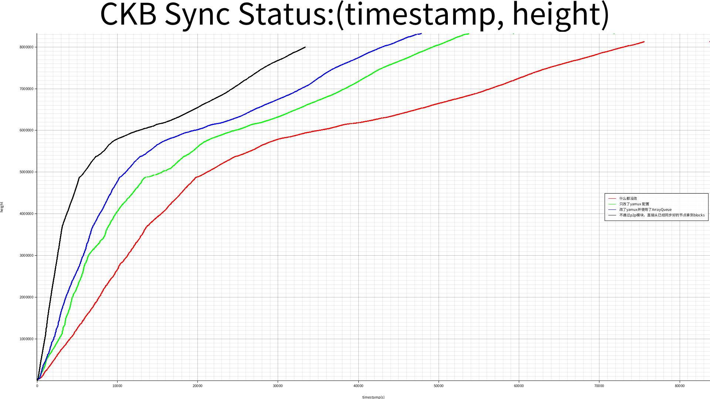

# ckb-log-analyzer

A simple tool to analyse ckb node log, draw a (timestamp->tip_height) synchronize graph.
```bash

$ ckb-log-analyzer --help
Usage: ckb-log-analyzer <COMMAND>

Commands:
  draw
  analyse
  help     Print this message or the help of the given subcommand(s)

Options:
  -h, --help  Print help information
```

## Example:
```bash
ckb-log-analyzer draw \
  --logs-path ckb-develop/data/logs/run.log --labels "Develop Branch" \
  --logs-path ckb-block-queue-20ms/data/logs/run.log  --labels "Use ArrayQueue Branch" \
  --outdir /tmp/
```


# CKB Log Analyze Result

## height and timestamp on sync progress

## epoch and average block size on sync progress

## block_size and height on sync progress

## epoch and average txs count on sync progress

## height and txs count on sync progress

## epoch and average cycles on sync progress

## height and cycles on sync progress

## Red: yamux-1M window size vs Blue(big ArrayQueue)

## All
- red: nothing changed
- green: change yamux window size to 1M
- blue: change yamux window size to 1M & use crossbeam_queue:ArrayQueue
- black: disable p2p module, load headers and blocks from a latest-top-synced ChainDb


