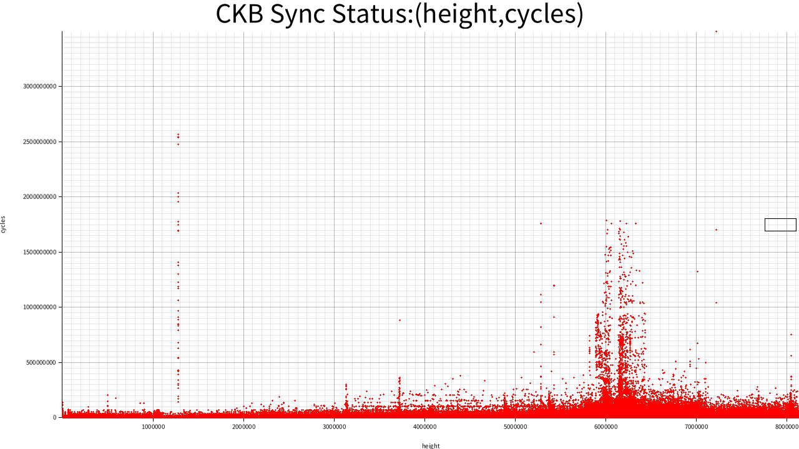

# CKB Log Analyze Result
## height and timestamp on sync progress

## epoch and average block size on sync progress

## block_size and height on sync progress

## epoch and average txs count on sync progress

## height and txs count on sync progress

## epoch and average cycles on sync progress

## height and cycles on sync progress

## Red: yamux-1M window size vs Blue(big ArrayQueue)

